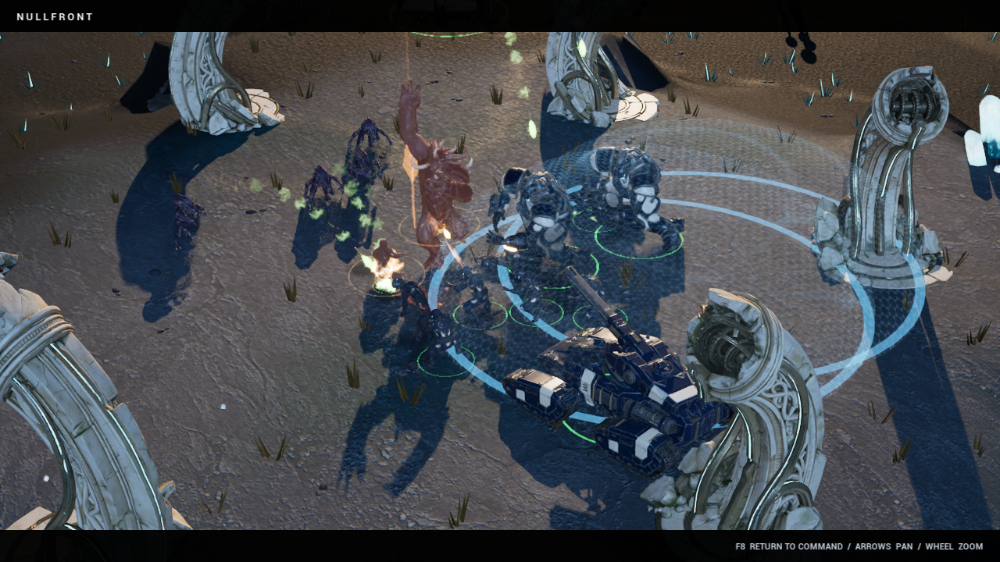

# NULLFRONT: Frontier Wars

A native science-fiction real-time strategy game for Apple Silicon Macs. Lead Commander Ada Voss through a four-chapter story campaign, or command one of three original factions in skirmishes across two battlefields.

**[Download NULLFRONT for macOS](https://github.com/Slimetoad/nullfront/releases/latest)** · **[Visit the game website](https://slimetoad.github.io/nullfront/)** · **[Field manual](FIELD-MANUAL.md)**

## A Living Frontier · 0.6.0

Detailed art now covers **all 47 battlefield types**, including **23 structures** across the Concord, Bloom, and Lumen. Animated workers and aircraft join the infantry and heavy armor, with moving tools, thrusters, weapons, and turrets. Textured fire, smoke, energy, and impact effects play across newly detailed basalt, mineral vents, and resource crystals.

Heavy attacks now announce their release: sidestep a Luminar beam, escape melee reach, or close inside a deployed Hammer’s minimum range. Units brace and recoil, wreckage settles, and important impacts and commands retain room in the audio mix. F1 cycles idle workers, F2 selects the complete army, and manual zooming keeps control of the cinematic camera.

## The Quiet Meridian

Eleven days after a colony falls silent, its relay transmits a child's voice. Commander Ada Voss has orders to destroy the signal. She chooses to answer it.

**The Quiet Meridian** is a four-chapter campaign with illustrated briefings, battlefield dialogue, changing objectives, and chapter unlocks saved between sessions. Recover a relay, defend an evacuation, destroy the resonators, and confront the Meridian Heart. Keep Voss and your headquarters alive throughout.

Press **F6** at the title screen to open Campaign. Choose an unlocked chapter, press **Enter** for its briefing, then **Enter** again to deploy. Completed chapters can be replayed.

## Command the frontier

- Three original factions: **The Concord**, **The Bloom**, and **The Lumen**.
- Two maps: **Ashfall Mesa** and **Frostglass Rift**.
- Single-player skirmishes against AI with four difficulty levels.
- **Rapid Deployment** starts with a base and strike force. Capture the central relay to strengthen your economy, or choose **Classic Build-up**.
- Detailed art across the complete roster: workers, infantry, aircraft, heavy units, structures, and resources.
- Animated workers and aircraft, character movement, attacks and deaths, and moving mechanical assemblies.
- Heavy battlefield units: the Concord Warden mech and Hammer siege tank, Bloom Behemoth, and Lumen Lancet.
- Textured combat effects, light-reactive smoke, hex-pattern shield ripples, scorched ground, and tumbling armor debris.
- Detailed faction bases, fractured basalt outcrops, luminous resource crystals, and mineral vents.
- An original adaptive stereo score and six new weapon/explosion recordings.
- **F8 cinematic view** hides the interface; **Watch Battle / F9** launches an immediate combined-arms clash.
- An original opening cinematic; **Watch Intro / F7** replays it from the title screen.

This is a downloadable Mac game. Browser play, Windows, Intel Mac, and online multiplayer builds are not included in this release.

## Install and play

**Requirements:** Apple Silicon Mac (M-series), macOS 14 or newer. The download is **920 MiB** (965,057,666 bytes), and the app is approximately **1.25 GiB** (1,334,289,971 bytes). Allow additional space to download and extract the archive. Performance varies by hardware; use the in-game Graphics setting if needed.

1. Open the [latest release](https://github.com/Slimetoad/nullfront/releases/latest) and download **NULLFRONT-0.6.0-macOS-arm64.zip**.
2. Extract the ZIP and move **NULLFRONT.app** into your Applications folder.
3. Open NULLFRONT. Press **F6** for the campaign, or choose your faction and map and press **Enter** to launch a skirmish.

This public preview is ad-hoc signed and has **not been notarized by Apple**. macOS may block its first launch. If you choose to run it, follow [Apple’s instructions for opening an app from an unknown developer](https://support.apple.com/en-us/102445): try opening the app, then use **System Settings → Privacy & Security → Open Anyway** for this app. No system-wide security change is needed.

The release includes [SHA256SUMS-0.6.0.txt](SHA256SUMS-0.6.0.txt) to verify the download and **FIELD-MANUAL.md** for detailed controls. GitHub’s automatically generated “Source code” archives contain this website and documentation; download the named Mac ZIP to play.

## First commands

Left-click or drag to select, right-click to move or act, **A + click** to attack-move, **F2** to select your army, and **F8** to toggle cinematic view. The objective panel's **Locate** button finds your next target. **Esc** cancels targeting or opens the pause menu. Hover command buttons for costs and hotkeys.

## Credits

Built with Unreal Engine. Unreal Engine is a trademark or registered trademark of Epic Games, Inc. in the United States of America and elsewhere. Unreal Engine, Copyright 1998–2026, Epic Games, Inc. All rights reserved. Included runtime notices are in the application bundle.

Campaign paintings, character concepts, faction illustrations, and terrain surfaces include AI-generated artwork. Character, vehicle, structure, and scenery assets use Nano Banana Pro concept art and Meshy models generated through Fal. Animated characters use Meshy rigging and animation, with game-specific materials, animation blending, aiming, articulated model parts, and weapon effects. Original soundtrack cues and six combat effects were generated with ElevenLabs models through Fal, then edited and mixed for the game. The opening cinematic was created with MiniMax H3 Max via Fal.ai. It uses AI-generated cinematic imagery, not gameplay footage. Campaign paintings are labeled as key art on the website; battlefield captures show the running game. Native model-gallery images are labeled as roster showcases.

This repository distributes the game and its public website/documentation. It does not grant an open-source license for the game.
