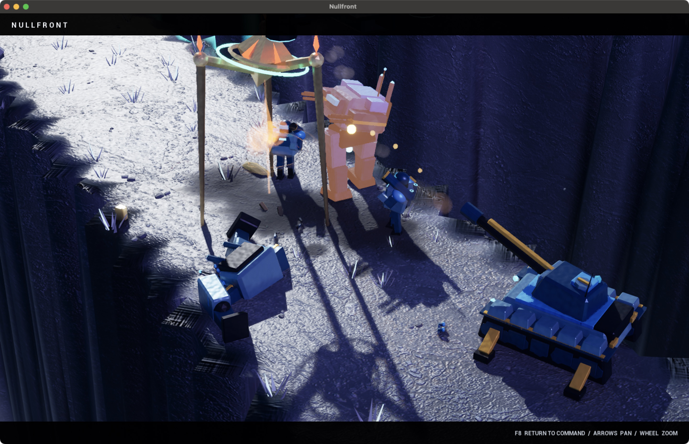

# NULLFRONT: Frontier Wars

A native science-fiction real-time strategy game for Apple Silicon Macs. Command an armored army, an evolving swarm, or a civilization of shields and light across two battlefields.

**[Download NULLFRONT for macOS](https://github.com/Slimetoad/nullfront/releases/latest)** · **[Visit the game website](https://slimetoad.github.io/nullfront/)** · **[Field manual](FIELD-MANUAL.md)**

## Public preview · 0.4.0

- Three original factions: **The Concord**, **The Bloom**, and **The Lumen**.
- Two maps: **Ashfall Mesa** and **Frostglass Rift**.
- Single-player skirmishes against AI with four difficulty levels.
- **Rapid Deployment** starts with a base and strike force. Capture the central relay to strengthen your economy, or choose **Classic Build-up**.
- Articulated infantry aiming and alien claw strikes, directional hit reactions, and weightier movement.
- Light-reactive smoke, hex-pattern shield ripples, scorched ground, and tumbling armor debris.
- An original adaptive stereo score and six new weapon/explosion recordings.
- **F8 cinematic view** hides the interface; **Watch Battle / F9** launches an immediate combined-arms clash.

This is a downloadable Mac game. Browser play, Windows, Intel Mac, and online multiplayer builds are not included in this release.

## Install and play

**Requirements:** Apple Silicon Mac (M-series), macOS 14 or newer. Allow approximately 770 MiB for the app, plus space to download and extract the archive. Performance varies by hardware; use the in-game Graphics setting if needed.

1. Open the [latest release](https://github.com/Slimetoad/nullfront/releases/latest) and download **NULLFRONT-0.4.0-macOS-arm64.zip**.
2. Extract the ZIP and move **NULLFRONT.app** into your Applications folder.
3. Open NULLFRONT, choose your faction and map, then press **Enter** to launch a skirmish.

This public preview is ad-hoc signed and has **not been notarized by Apple**. macOS may block its first launch. If you choose to run it, follow [Apple’s instructions for opening an app from an unknown developer](https://support.apple.com/en-us/102445): try opening the app, then use **System Settings → Privacy & Security → Open Anyway** for this app. No system-wide security change is needed.

The release includes **SHA256SUMS.txt** to verify the download and **FIELD-MANUAL.md** for detailed controls. GitHub’s automatically generated “Source code” archives contain this website and documentation; download the named Mac ZIP to play.

## First commands

Left-click or drag to select, right-click to move or act, **A + click** to attack-move, **F2** to select your army, and **F8** to toggle cinematic view. **Esc** opens the pause menu. Hover command buttons for costs and hotkeys.

## Credits

Built with Unreal Engine. Unreal Engine is a trademark or registered trademark of Epic Games, Inc. in the United States of America and elsewhere. Unreal Engine, Copyright 1998–2026, Epic Games, Inc. All rights reserved. Included runtime notices are in the application bundle. Faction illustrations and the basalt surface include AI-generated artwork. Original soundtrack cues and six combat effects were generated with ElevenLabs models through Fal, then edited and mixed for the game.

This repository distributes the game and its public website/documentation. It does not grant an open-source license for the game.
